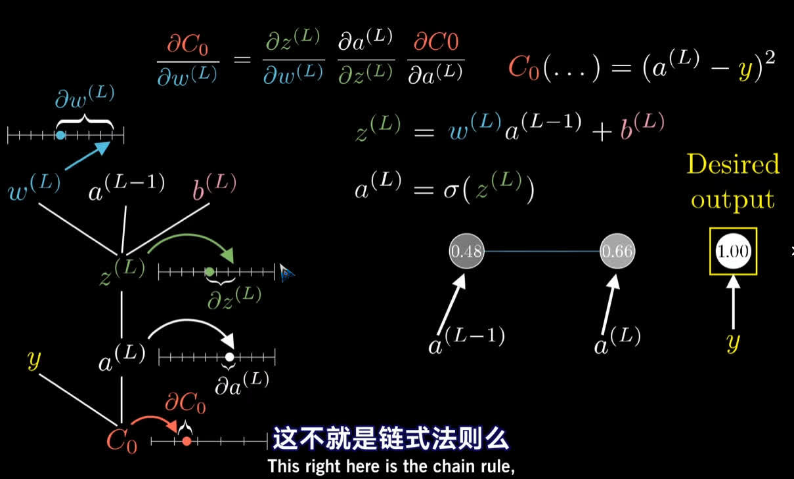
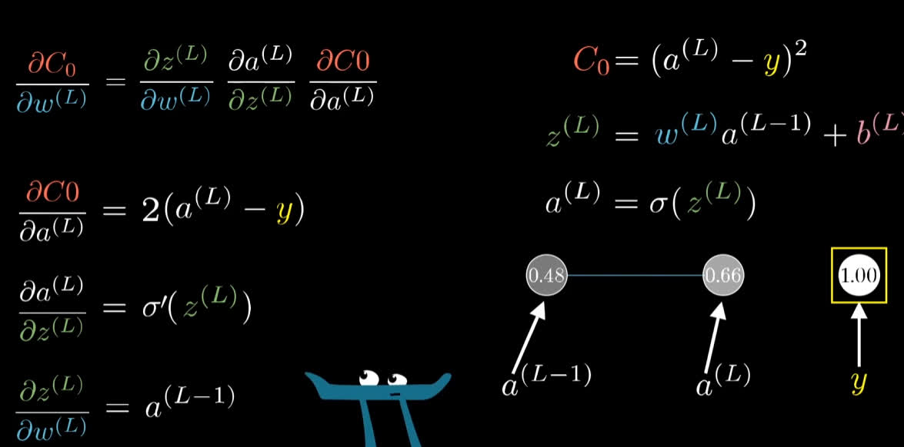
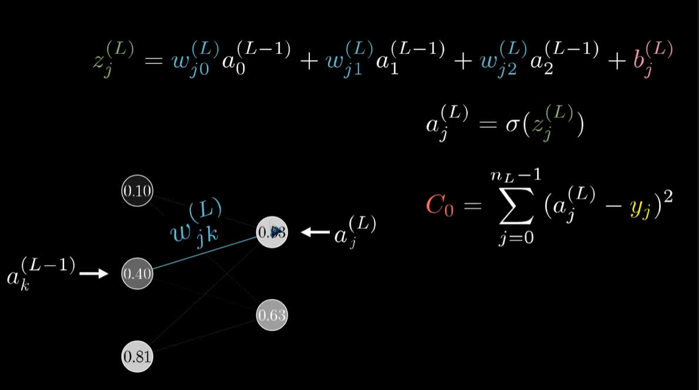

# <font color=#0099ff> **深度学习 - 3B1B** </font>

> `@think3r` 2025-02-17 23:05:14
>
>1. [**3B1B --> 深度学习之神经网络的结构**](https://space.bilibili.com/88461692/channel/seriesdetail?sid=1528929)
>    - [【中文配音】深度学习（3Blue1Brown）](https://www.bilibili.com/video/BV1szpFedEV2)
>2. [Neural Networks](https://www.3blue1brown.com/topics/neural-networks)
>3. <<深度学习和神经网络>> :
>    - <http://neuralnetworksanddeeplearning.com/>
>    - [中文翻译](https://github.com/zhanggyb/nndl)

- convolutional neural network 卷积神经网络 `CNN` --> 擅于图像识别
- Long short-term memory network 长短期记忆网络 `LSTM` --> 擅于语音识别
- 多层感知器 MLP
- system prompt
- 第一段对话 : 用户的出示问题/提示词

手写识别系统 : 神经网络中的 "hello world".

- 数字图像分辨率为 `28x28`, 每个像素的灰度值为 `0~1`
  - 决定网络输入层第一层中 784 个神经元的激活值
  - 数据源 : `mnist`
    - [MNIST database wikipedia](https://en.wikipedia.org/wiki/MNIST_database)
- 第二层识别短边 : 16 个神经元
- 第三层识别图案 : 16 个神经元
- 第四层组合图案并得到结果: 10 个神经元
- 以上述四层神经元为例, 其总参数量为 : $13002 = {(784 * 16 + 16 * 16 + 16 * 10)}_{weights} + {(16 + 16 + 10)}_{biases}$
- NOTE: 以上的功能性解释全是猜测.... 实际并不是这个原理和实现方法...

## <font color=#009A000> 0x00 神经网络 </font>

1. 组成 :
   - 神经元 : 单个的数值, 激活值, 计为 $a_n$
   - 神经元之间的连线 : 权重 weights, 计为 $w_n$
   - 偏置值 biases : $b$, 不希望过早激发
     - 当权重大于某个值, 才会使得激发有意义
2. 计算 :
   - 加权和的计算  : $a_0^{(1)} = \sigma(w_{0,0} \; a_0^{(0)} + w_{0,1} \, a_1^{(0)} + \cdots + w_{0,n} \, a_n^{(0)} + b_0)$
   - NOTE:
     1. $a_0^{(1)}$ 表示第一个神经元在第一层（或时间步）的激活值, 其中的中的上标 $^{1}$ 表示神经网络的层数, 下标 $_0$ 则表示当前层神经元的 idx
     2. $\sigma$: 代表一个激活函数，通常是一个非线性函数，如 sigmoid, ReLU 等
     3. $w_{0,1}$ 表示权重，用于连接不同神经元. $w_{0,1}$ 是连接第一层第一个神经元到第二层第二个神经元的权重，以此类推。
     4. $a_0^{(0)}, a_1^{(0)}, ..., a_n^{(0)}$ : 表示上一层（或初始输入）神经元的激活值。
     5. $b_0$ 表示当前神经元的偏置值
   - 矩阵计算的形式 : $\; a^{1} = \sigma(W \, a^{0} + b)$

$$
\begin{bmatrix}
    a_0^{(1)} \\
    a_1^{(1)} \\
    \vdots \\
    a_n^{(1)}
\end{bmatrix} =
\sigma \left(
\begin{bmatrix}
    w_{0,0} & w_{0,1} & \cdots & w_{0,n} \\
    w_{1,0} & w_{1,1} & \cdots & w_{1,n} \\
    \vdots & \vdots & \ddots & \vdots \\
    w_{k,0} & w_{k,1} & \cdots & w_{k,n}
\end{bmatrix}
\begin{bmatrix}
    a_0^{(0)} \\
    a_1^{(0)} \\
    \vdots \\
    a_n^{(0)}
\end{bmatrix} +
\begin{bmatrix}
    b_0 \\
    b_1 \\
    \vdots \\
    b_n
\end{bmatrix}
\right)
\; \\[8px] \;
\text{NOTE:} \;
\sigma \left(
\begin{bmatrix}
    x \\
    y \\
    z
\end{bmatrix}
\right) =
\begin{bmatrix}
    \sigma(x) \\
    \sigma(y) \\
    \sigma(z)
\end{bmatrix}
$$

3. 对应 python 代码如下 :

    ```python
    class Network(object):

        def __init__(self, sizes):
          # 初始化权重和偏置

        " https://github.com/mnielsen/neural-networks-and-deep-learning/blob/master/src/network.py "
        """ b 为偏置, w 为权重(矩阵) """
        def feedforward(self, a):
            """Return the output of the network for an input vector a"""
            for b, w in zip(self.biases, self.weights):
                a = sigmoid(np.dot(w, a) + b)   # 核心计算公式
            return a
    ```

4. 激活函数 : 将加权和映射到 0~1 的区间内
   - 线性整流函数 Rectified linear unit : $ReLU(a) = max(0, a)$
     - 更方便于训练
   - ~~Sigmoid 函数~~ :  $\sigma(x) = \frac{1}{1 + e^{-x}}$
     - 过去使用较多, 为了部分模仿生物学上的神经元什么时候激发, 但它很难训练, 也并没有让训练结果变得更好

## <font color=#009A000> 0x01 梯度下降法 Gradient descent </font>

- cost function 代价函数(告诉电脑预测结果的好坏及严重程度) :
  - 单个样本上上代价也叫做 `Loss / 损失 / 误差`, By 吴恩达.
    - 不过现在也有很多人混着用, 即 `loss function == cost function`
  - 典型算法 :
    - 差值的平方和 : $(真实值 - 模型预测输出值)^2$ , **这个值越小越好**.
  - 目标 : <u>使用手头上几万个训练样本, 将其平均代价值尽可能的降低</u>
  - 函数抽象 :
    - 神经网络 :
      1. input : 784 pixels/numbers
      2. output : 10 numbers
      3. parameters : 13002 weights+biases
    - 代价函数 : $C(W) = C(W_1, W_2, ..., W_{13002})$
      1. input : 13002 weights+biases
      2. output : 1 number (the cost)
      3. parameters : 海量训练数据
- 梯度下降算法 : **按照负梯度的倍数, 不停调整函数输入值的过程**
  - 通常情况下 通过求导可得函数极值点 : $\frac{dC}{dw}(w) = 0$
    - 导数是针对一元函数而言的，描述了函数在某一点的瞬时变化率。例如，函数 $f(x)$ 在 x 处的导数 $f'(x)$ 表示函数值 f(x) 随 x 变化的快慢。导数是一个标量，它的符号表示函数在该点是递增还是递减。
    - 梯度是针对多元函数而言的，描述了函数在某一点沿各个方向的最大变化率。例如，函数 $f(x, y)$ 在点 $(x, y)$ 处的梯度 $\nabla f(x,y)$ 是一个向量，它的每个分量表示函数沿对应坐标轴方向的偏导数。梯度向量的方向是函数在该点增长最快的方向.
      - $\nabla$ 表示梯度
  - $\nabla C(x,y)$ ---> 找到最大值, 取反即为下降最快的方向 ---> $-\nabla C(\vec{W})$ :
    - 表明如何具体的修改每个参数, 才能让代价函数的值下降的最快, 让我们找到一个局部最小值
      - 负梯度向量中每个值的正负号, 表明应该调大还是调小参 $W_n$
      - 负梯度向量中每个值的大小, 表明调整那个值会影响更大(调整哪个值, 性价比更高, 可以让 cost 更小)
    - 计算梯度的算法是神经网络的核心 --> 反向传播算法(`BP`)
    - cost function 是 float, 连续值
  - 深度学习中学习的含义 : *找到特定的权重偏置, 从而使一个代价函数最小化*

## <font color=#009A000> 0x02 反向传播算法 back propagation </font>

- 赫布理论 Hebbian theory : `neurons that fire together wire together.`
- 反向传播 : 传播的是后一层对前一层的期望
- $-\eta \nabla C(\vec{w}) = -\eta \nabla C(w_1, w_2, ..., w_{13001})$ :
  - 表示函数 C 在点 $(w_1, w_2, ..., w_{13001})$ 处的负梯度向量，乘以学习率 $\eta$
  - $\eta$ (eta)： 这是一个希腊字母，通常表示学习率，在机器学习中是一个重要的超参数, 控制每次更新的步长
  - $C(w_1, w_2, ..., w_{13001})$： 表示一个多元函数，其中 C 是函数名，$(w_1, w_2, ..., w_{13001})$ 表示函数的自变量，这里有 13001 个自变量
- 工程上的妥协 :
  - 理论上要全部跑完样本, 得到其 cost, 再次通过 BP 下降, 然后重复.
  - 实际上会将训练样本打乱, 分组成多个 **`minibatch`**, 计算出当前 minibatch 下降的一步, 然后重复下一个 minibatch.
    - 又称为随机梯度下降 Stochastic  gradient descent

### <font color=#FF4500> 反向传播的微积分原理 </font>

以最简单的四个一维线性神经网络为例 :, 其代价函数为 : $C(w_1, b_1, w_2, b_2, w_3, b3)$, 其中 $w_n$ 为神经元之间的权重, $b_n$ 则为后三个神经元的偏置.





$$
Cost --> C_0(...) = (a^{L} - y)^2
\\[5px]
Z^{(L)} = w^{L} \; a^{L-1} + b^{L}
\\[5px]
a^{L} = \sigma(z^{L})
\\[8px]
\frac{\partial C_{0}}{\partial w^{(L)}} = \frac{\partial z^{(L)}}{\partial w^{(L)}} \frac{\partial a^{(L)}}{\partial z^{(L)}} \frac{\partial C_{0}}{\partial a^{(L)}} = a^{(L-1)} \sigma'(z^{(L)}) 2(a^{(L)} - y)
\\[6px]
\frac{\partial C}{\partial w^{(L)}} = \frac{1}{n} \sum_{k=0}^{n-1} \frac{\partial C_{k}}{\partial w^{(L)}}
\\[8px]
\nabla C = \begin{bmatrix}
\frac{\partial C}{\partial w^{(1)}} \\
\frac{\partial C}{\partial b^{(1)}} \\
\vdots \\
\frac{\partial C}{\partial w^{(L)}} \\
\frac{\partial C}{\partial b^{(L)}}
\end{bmatrix}
\\[8px]
\frac{\partial C_{0}}{\partial a_{k}^{(L-1)}} = \sum_{j=0}^{n_{L}-1} \frac{\partial z_{j}^{(L)}}{\partial a_{k}^{(L-1)}} \frac{\partial a_{j}^{(L)}}{\partial z_{j}^{(L)}} \frac{\partial C_{0}}{\partial a_{j}^{(L)}}
$$

## <font color=#009A000> 0x03 transformer </font>

机器学习的理念 :

- 不要试图在代码中明确定义如何执行一个任务, 而是去构建一个具有可调参数的灵活架构
- E.g. :
  - linner regression 线性回归, 输入输出都是数字, 模型为两个连续参数 $\{k ,\; b\}$
    - 目标就是明确上述两个参数, 以尽可能拟合数据
  - GPT3 有 `175B` 参数, 27933 矩阵, 分为 8 类 : embendding, key, query, value, output, up-projection, down-projection, unembendding.

分类 :

- text 2 text
  - transformer 专注于语言翻译
- text 2 voice, voice 2 text
- text 2 image, image 2 text

GPT (Generative Pretrained Transformer)

- Generative 表示用来生成文本的机器人
- Pretrained 指的是模型经历了从大量数据中学习的过程,
  - Pre 暗指能针对具体任务, 通过额外训练来进行微调
- Transformer 是一种特殊的神经网络(一种机器学习模型)
  - 2017 年 Google 论文 : [**attention is all you need**](https://arxiv.org/pdf/1706.03762), (当时)专注于语言翻译

概览 :

1. `embedding` --> 分词 : tokenization (文本/视频/音频), raw2vec
2. `attention block` 注意力模块 :
   - 找出上下文中哪些词, 会改变哪些词的含义并应该更新为何种含义. E.g. :
     - 机器学习的 model ≠ 模特的 model, attention 就是找到这些词语, 并更新其含义(vector 值得更新)
3. `Multilayer Perceptron`(`MLPs`) 多层感知器 / feed-forward layer 前馈层 :
   1. 并行处理, 每个 vector 的处理流程一样, vector 之间不再互相影响
   2. 对每个向量询问一系列问题, 并根据答案来更新
4. 多个前两层 `attention` 和 `Multilayer Perceptron` 点重复结构
5. vec2text : 接下来可能单词概率的向量

### <font color=#FF4500> embendding </font>

- 预设词库, `Embedding matrix` 嵌入矩阵 $W_E$ :
- 每个词都对应一个 vec, 决定第一步中每个单词对应的向量
  - 高纬空间向量 : GPT-3 有 50257 个 token, 每一个维度有 12288 维, `Embendding` 总参数: $6.17B \approx 12288 * 50257$
    - $W_E = {{\mathbf{v}}_i }_{i=1}^{50257} \quad \mathbf{v}_i \in \mathbb{R}^{12288}$
- E.g. : 将上述高维空间切片为三维, 用三维空间中的一个方向编码性别信息, 会更有优势.
  - 详见 : [GloVe: Global Vectors for Word Representation](https://nlp.stanford.edu/projects/glove/)
  - $E(queue) \approx E(King) + E(woman) - E(man)$
  - $E(man) - E(woman) \approx E(father) - E(mother)$
  - 两个向量的点积值得符号可以衡量他们的相似程度(角度)
- NOTE:
  - vector 中还嵌入/编码了单词的位置信息
  - 刚开始输入时, 每个单词的 vector 仅仅是从预设词库中直接取出的, 没有上下文信息
    - 流经网络的主要目的就是为了能让每个 vector 获得更具体丰富的含义
    - 每次网络处理的 vector 长度称为 context-size, GPT-3 的为 2048

### <font color=#FF4500> 位置编码 Positional Encoding </font>

${\color{red}{\mathbf{z}_i}} = \mathbf{e}_i + \mathbf{PE}_i$

- $e_i$：这是输入词 i 的词嵌入（embedding）向量，表示词汇的语义信息，通常是通过查找词嵌入矩阵获得的一个固定维度的向量。
- $PE_i$ ：这是 位置编码（Positional Encoding）向量，表示词 i 在序列中的位置。位置编码是通过正弦和余弦函数生成的，或者也可以通过可训练的参数学习得到。每个位置的编码是一个与词嵌入相同维度的向量，用来提供该词在序列中的位置信息。
- $Z_i$ 这是词 i 最终的输入向量, 包含了词语的语义信息, 使得 Transformer 模型可以在进行自注意力计算时理解词语的顺序。

### <font color=#FF4500> 模型的输出 </font>

- 每次模型输出的矩阵中, 利用最后一个列向量和一个 unembedding-matrix(解嵌入矩阵) $W_U$ 映射到 50k 的 token 列表中
  - $W_U$ 在模型初始时也是随机的, 随着训练而逐渐可用
  - ${\color{red}{W_U}} = {\mathbf{v}\_i}_{i=1}^{12288}, \quad \mathbf{v}_i \in \mathbb{R}^{50257}$
- 然后用 soft-max 将输出的 50k 列向量归一化, 从中得到概率最大的那个值, 即为 50k token 列表中最有可能的结果.
  - soft-max 的含义 : 把任意数列转化为合理概率分布 (归一化.)
    - $e^{x_1} / \sum_{n=0}^{N-1} e^{x_nT}$
  - soft-max with temperature(`Temp`) : $e^{x_1 / \color{red}{T}} / \sum_{n=0}^{N-1} e^{x_n / \color{red}{T}}$
    - $\color{red}{T}$ : 温度, 类似于热力学中的温度.
      - 当 $T$ 较大时, 会给低值赋予更多权重, 让分布更均匀一些 : 更有创造力, 更发散, 但是更容易跑偏
        - 温度设置过高(如超过 1.5), 模型会过度探索低概率的词汇，从而失去一致性。
      - 当 $T = 0$ 时, 只有最大值为 `1.0`, 其它值全为 `0.0` : 更老套/保守, 几乎没有随机性
      - GPT API 中对 Temp 的限制最大值为 2.0, 通常建议的调节范围为 `0.0` ~ `1.0`
    - 通常人们将 soft-max 的输入称为 `Logits`, 输出称为 `Probabilities`
- E.g. : 将整个悬疑推理小说输入到大模型中, 其第一个/最后一个词输出为杀手的名字, 则上述整个小说被称为上下文 context, 上述 context 都会对最后的一个输出列向量(杀手名字)产生影响.

### <font color=#FF4500> transformer </font>

<u>*2017 年 Google 论文* : [**attention is all you need**](https://arxiv.org/pdf/1706.03762)</u>

单头注意力机制 single head attention : $\color{yellow}{\text{Attention}(Q, K, V) = \text{Softmax}\left( \frac{Q K^T}{\sqrt{d_k}} \right) V}$

- $W_Q \; \vec{Z_i} = \vec{\color{red}{Q_i}}$
  - $\vec{Q_i}$  : `Query` of token, 编码为一个向量, 维度较小 (E.g. : 128 维)
  - $W_Q$ 模型参数, 训练得到
- $W_K \; \vec{Z_i} = \vec{\color{red}{K_i}}$
  - $W_K$ 也是由模型训练得到
- $\vec{Q_i} \; \vec{K_i} = dotNum$ : 结果的相似性 --> softmax

多头注意力机制 multi head attention

---

1. 每个 token 首先通过查找表被映射为一个高维的嵌入向量，例如 $x \in \mathbb{R}^{d}$，其中 $d$ 是嵌入的维度
2. 线性变换：
   - 为了将嵌入向量转换到三个不同的特征空间，模型定义了三个可学习的权重矩阵：
     - $W^Q \in \mathbb{R}^{d \times d_q}$ 用于生成 Query
     - $W^K \in \mathbb{R}^{d \times d_k}$ 用于生成 Key
     - $W^V \in \mathbb{R}^{d \times d_v}$ 用于生成 Value
   - 对于一个 token 的嵌入向量 \( x \)，分别计算： $q = x W^Q,\quad k = x W^K,\quad v = x W^V$
   - **Query 和 Key：** 这两个向量用于计算不同 token 之间的相似度或相关性。具体来说，在自注意力机制中，一个 token 的 Query 向量会与其他所有 token 的 Key 向量进行点积运算，然后经过缩放和 softmax 得到注意力权重。这样可以衡量当前 token 与其他 token 在语义上的关联程度。
   - **Value：** Value 向量包含了 token 本身的实际信息。在后续的步骤中，计算得到的注意力权重将用于对各个 token 的 Value 向量进行加权求和，从而生成一个新的、融合了全局上下文信息的表示。
