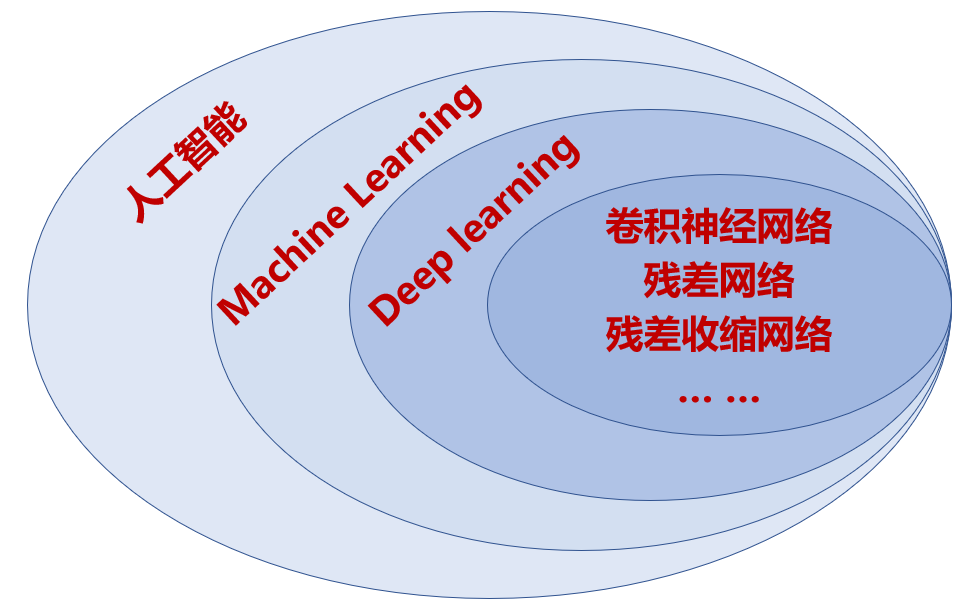

#  **Ai** 

> `@think3r` 2024-03-25 17:18:45
>
> 1. 学习/大模型训练 :
>    - [minimind --> 「大模型」3 小时完全从 0 训练 26M 的小参数 GPT](https://github.com/jingyaogong/minimind)
>    - [动手学深度学习 Dive into Deep Learning，D2L.a -- github](https://github.com/d2l-ai/d2l-zh) : 书 + 代码
>    - [LLMs-Zero-to-Hero](https://github.com/bbruceyuan/LLMs-Zero-to-Hero)
>    - 浙江大学-大模型原理与技术 :
>      - [【浙江大学-大模型原理与技术】](https://www.bilibili.com/video/BV1PB6XYFET2/?vd_source=471837a8669f91a06fea91667e4334ae)
>      - [大模型基础](https://github.com/ZJU-LLMs/Foundations-of-LLMs)
>    - [**安德烈·卡帕西(Andrej Karpathy) AI 普及课：深入探索像ChatGPT这样的大语言模型**](https://www.bilibili.com/video/BV1WnNHeqEFK)
>    - [记录大模型应用过程遇到的相关问题及解决方法](https://github.com/wyf3/llm_related)
>    - [**3B1B --> 深度学习之神经网络的结构**](https://space.bilibili.com/88461692/channel/seriesdetail?sid=1528929)
>      - [【中文配音】深度学习（3Blue1Brown）](https://www.bilibili.com/video/BV1szpFedEV2)
> 2. [科普 深度学习训练和推理有何不同？](https://zhuanlan.zhihu.com/p/66705645) TODO:
> 3. [机器学习和深度学习区别的简要概述](https://zhuanlan.zhihu.com/p/69776750)
> 4. [人工智能的发展历史](https://winterwindwang.github.io/2021/04/27/dl_story.html)  TODO:
> 5. [有关AI PC，英伟达都做了些啥？顺便展望明年的电脑](https://zhuanlan.zhihu.com/p/672487308)
> 6. Book :
>    - <<人工智能 : 现代方法>> 第四版
>    - [<<nndl-book, 神经网络与深度学习>>](https://nndl.github.io/)
> 7. TODO:
>    - huggingFace
>      - <https://huggingface.co/docs/transformers/v4.27.2/zh/index>
>      - <https://github.com/huggingface/transformers/blob/main/i18n/README_zh-hans.md>
>      - [hugging face 使用教程———快速入门](https://blog.csdn.net/u012863603/article/details/140658895)
>      - [【Huggingface Transformers】保姆级使用教程—上](https://zhuanlan.zhihu.com/p/448852278)
>    - transformer 结构详解 --> TODO: B 站搜索
> 8. ai-agents :
>    - [google ai 白皮书](https://ai-bot.cn/google-agent-white-paper/)
>    - <https://github.com/microsoft/autogen>
> 9. tools :
>    - [AI 工具集](https://ai-bot.cn/)
>    - 推理硬件
>      - 2080ti 22G 魔改版本 3k
>      - 192GB 统一内存的 M2 Ultra
>      - [大模型解决不了英伟达的难题](https://www.bilibili.com/video/av1954475860)
> 10. TODO: [**当我们发现毕生追求的知识在AI面前毫无价值时，如何重建存在的意义？**](https://www.zhihu.com/question/11103435299)

NOTE: ai 的相关放到 WSL2 中进行.

##  开源库 

> - 大模型统计 :
>   - [中国大模型列表 Awesome LLMs In China](https://github.com/wgwang/awesome-LLMs-In-China)
>   - <https://artificialanalysis.ai/> : Quality vs. Price --> 大模型质量价格统计
>   - [lmarena.ai](https://lmarena.ai/) : llm 排行榜(人工)
> - [有哪些开源的 AI 项目？](https://www.zhihu.com/question/65355806/answer/3154351532)
> - [谷歌15个人工智能开源免费项目推荐，开发者们又可以折腾了](https://zhuanlan.zhihu.com/p/92959056)
> - [大模型推理框架概述](https://juejin.cn/post/7286676030965317668)
> - [giteeAi](https://ai.gitee.com/)
> - [51 ai 专注于大中型企业, ai 落地应用的方法](https://www.53ai.com/)
> - [FFmpeg AI推理+图形渲染的可定制GPU管线](https://cloud.tencent.com/developer/article/2257849)
> - tools :
>   - <https://github.com/ggerganov/llama.cpp>
>   - [NVIDIA RTX AI Toolkit](https://github.com/NVIDIA/RTX-AI-Toolkit)
>   - RTX 神经网络着色器 (Neural Shader)
> - <https://zju3dv.github.io/MatchAnything/>
> - <https://github.com/KoljaB/RealtimeSTT>
> - <https://github.com/Anjok07/ultimatevocalremovergui>
> - [动画 GLSL 超分](https://github.com/bloc97/Anime4K/tree/master)
> - [极简部署AI音视频翻译配音工具 -- github-KrillinAI](https://github.com/krillinai/KrillinAI)

- 国外的 ai 云平台
  - [Hyperbolic](https://hyperbolic.xyz/)
  - [together-AI](https://together.ai/)
- [~~AoE (AI on Edge)~~](https://github.com/didi/AoE) : 滴滴的平台, 已停止维护
- [Mace (Mobile AI Compute Engine)](https://github.com/XiaoMi/mace) : 小米, 仍在维护(2024.3)
  - > 是一个专为移动端异构计算平台(支持Android, iOS, Linux, Windows)优化的神经网络计算框架。
- [Bolt](https://github.com/huawei-noah/bolt) : 华为, 最后维护为 23.7
  - > Bolt is a deep learning library with high performance and heterogeneous flexibility.
- [MNN](https://github.com/alibaba/MNN) : 阿里巴巴, 仍在维护
  - > MNN is a highly efficient and lightweight deep learning framework
- [NCNN](https://github.com/Tencent/ncnn) :腾讯, 仍在维护
  - [安卓端深度学习模型部署-以NCNN为例](https://zhuanlan.zhihu.com/p/137453394)
  - vulkan/neon
- [TNN](https://github.com/Tencent/TNN) : 腾讯, 最后维护为 2023.9
  - > TNN: developed by Tencent Youtu Lab and Guangying Lab, a uniform deep learning inference framework for mobile、desktop and server.
- [Ascend C算子编程语言](https://www.hiascend.com/ascend-c)
- 语义分割 :
  - SAM2 的 light 模型

##  端侧 API 

厂家 API :

- 华为 : [HuaWei HiAi Foundation](https://developer.huawei.com/consumer/cn/doc/hiai-Guides/sdk-data-security-0000001054024739)
- 高通 : [Qualcomm AI Engine Direct SDK](https://developer.qualcomm.com/software/qualcomm-ai-engine-direct-sdk)
- 联发科 : [NeuroPilot](https://neuropilot.mediatek.com/)

OS 厂家 :

- Android
  - [Android AICore](https://developer.android.google.cn/ml/aicore?hl=en)
    - [Create smarter apps](https://developer.android.google.cn/ml?hl=en)
    - [Google AI Edge SDK](https://ai.google.dev/tutorials/android_aicore)
  - [<u>**ML AI**</u>](https://developer.android.google.cn/ml?hl=en)
    - [**mlkit** -- github](https://github.com/googlesamples/mlkit) : google Samples, 一直在维护, iOS 也能用 ?
    - [使用 Android 11 进行机器学习：新功能](https://zhuanlan.zhihu.com/p/484195980)
  - [**Neural Networks API** -- Android](https://developer.android.google.cn/ndk/guides/neuralnetworks?hl=zh-cn)
    - [NeuralNetworks -- API](https://developer.android.google.cn/ndk/reference/group/neural-networks)
- iOS :
  - [Core ML](https://developer.apple.com/cn/machine-learning/core-ml/)
  - [机器学习 API, Create ML](https://developer.apple.com/cn/machine-learning/)

##  todo: 

> - [探索高通骁龙处理器中的Hexagon NPU架构](https://zhuanlan.zhihu.com/p/662831678)
> - [高通AI大揭秘：NPU引领四兄弟无敌，性能8.6倍于竞品！](https://zhuanlan.zhihu.com/p/686130670)
> - [<u>**ML AI**</u>](https://developer.android.google.cn/ml?hl=en)

- 神经网络, 深度学习, 机器学习, 模型, 算子, 训练, 推理, PTQ, QAT 量化感知训练
- 线性代数
- 各种硬件加速结构
- 端侧 / (NV)GPU 上的差异
- benchmark ?
- 框架 : Tensorflow，Pytorch，Caffe，MindSpore, LLM, CNN, Transformer
- 模型文件 : PB, TFLite, ONNX, CaffeModel
- 模型的优化、验证和部署
- 深层神经网络的哪些节点被激活
- 海康的人脸算法属于哪个 ? 🤔

##  history 

TODO:

##  机器学习 Vs 深度学习 

- 机器学习：需要人工准备各种特征数据，事先规划好训练的各种参数
- 深度学习：不需要人为准备特征，神经网络会提取数据，并且不需要人为干预参数，学习过程会自动生成参数，调整参数
  - **深度学习是机器学习中的一个特例**.
  - 深度学习会自动找出对分类很重要的特征，在机器学习中我们必须手动提供这些特征
- 以目标检测为例：机器学习需要规定图片的像素，长宽比例，物体轮廓，合格的参数标准等。而深度学习的卷积神经对图片卷积，池化提取各种特征，正向传播，反向传播调整参数，整个过程需要人为参与调整参数。

##  TODO: 

- Transformer 在结构上采用一种所谓的自注意力（self-attention）机制，捕捉全局相关性、在一个队列内不同 element 的关系。Transformer 最早主要适用于 NLP（natural language processing，自然语言处理），因为其自注意力机制能够让队列中每个 element 与其他所有 element 相关联，模型就能基于 element 关联上下文，来权衡其重要性。
- GPT 就是 Generative Pre-trained Transformer 的缩写，基于或部分基于 Transformer 是很符合这种模型特性的。LLM 大语言模型普遍是基于 Transformer 结构，比如 ChatGLM，比如 Llama，这两年都挺火。
- 另外，原本 CNN 卷积神经网络和 Transformer 的工作领域是有差别的，前者被认为更适合做图像分类、对象识别之类的工作。但后来谷歌发了个 paper，说把图像切割成小片，每一片当成一个单字、token，则也能以较高精度来学习如何识别对象，达成不错的并行度和灵活性，令 Transformer 也适用于大规模图像识别、CV 工作。Diffusion 模型就有基于 Transformer 的尝试。
- 在 AI 训练和推理的问题上，大量市场研究数据都表明推理的市场一定是更大的——施耐德电气的数据是，从用电量的角度来看，全球范围内 AI 训练和推理功耗，两者现在的比例大约是 2:8；未来还会更进一步偏向推理侧。所以很显然英伟达是不会放过推理市场的。
- PC 行业媒体做显卡评测时，前两年就已经把 Stable Diffusion 的本地推理纳入考量范畴了——大部分主要是基于 Stable Diffusion WebUI（A1111，能跑 Stable Diffusion 的一个 GUI 图形用户界面）。
  - 用 GeForce RTX 显卡跑 Stable Diffusion WebUI 的基础当然是 CUDA。
  - 4090 在 TensorRT 的加持下, 可以每秒钟出图一张....
- AI-PC : 虽说现阶段 PC 行业几个主要市场竞争者的芯片跑生成式 AI 的上层软件栈差别非常大，但最终都是为知名的大模型服务

---

##  推理模型的比较 

以下是 OpenAI 和 DeepSeek 推理系列模型的详细信息，包括发布时间、描述、收费标准和推理能力评分：

| 模型名称           | 发布时间           | 描述                                                         | 收费标准（每百万个输入 tokens） | 收费标准（每百万个输出 tokens） | 推理能力评分（满分100） |
|--------------------|--------------------|--------------------------------------------------------------|----------------------------------|-----------------------------------|------------------------|
| **GPT-4o**         | 2024年5月13日      | 高效的多模态模型，支持文本、图像和音频输入，性能优异。       | $2.50                           | $10.00                           | 85                     |
| **GPT-4o mini**    | 2024年7月18日      | 更小巧的版本，适用于快速、轻量级任务，成本更低。             | $0.15                           | $0.60                            | 75                     |
| **o1**             | 2024年9月12日      | 专为复杂推理任务设计，适用于数学、科学和编程等领域。         | $15.00                          | $60.00                           | 90                     |
| **o1 mini**        | 2024年9月12日      | o1 的小型版本，提供更低的成本和延迟，适用于一般推理任务。     | $5.00                           | $15.00                           | 80                     |
| **DeepSeek-R1**    | 2025年1月20日      | 开源的推理模型，性能与 OpenAI 的 o1 相当，定价更为低廉。     | ¥1.00（约 $0.14）               | ¥16.00（约 $2.19）               | 90                     |
| **o3-mini**        | 2025年1月31日      | 最新的推理模型，提供更高的性价比，首次向免费用户开放。       | $1.10                           | $4.40                            | 95                     |

请注意，以上推理能力评分基于公开的基准测试结果和专家评估，可能会随着模型的进一步优化而变化。

对于具体的收费标准和最新的定价信息，建议访问 OpenAI 和 DeepSeek 官方网站或联系相关客户支持以获取最准确的信息。
