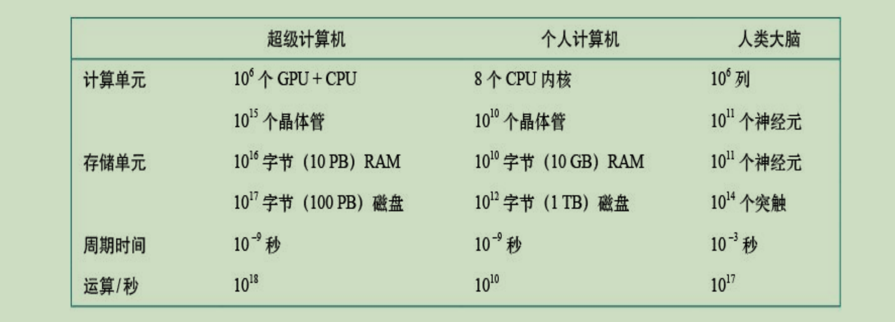

#  **<人工智能> 笔记** 

> `@think3r` 2024-03-28 11:42:40
>
> 1. <<人工智能 : 现代方法>> 第四版
> 2.[<<nndl-book, 神经网络与深度学习>>](https://nndl.github.io/)

##  人工智能 : 现代方法 

现代方法 : 标准解释是“选择从当下的角度讲述人工智能的故”。

1. 1995 年, 第一版
   - 学术界
   - 传统人工智能方法占据主导 : 智能问题的求解和有关知识表示与推理的部分
   - 第二部分 & 第三部分
2. 2003 年, 第二版
   - 转折点
   - 加入统计相关内容 : 数据驱动的人工智能方法变得越来越重要
   - 第四部分 & 第五部分
3. 2009 年, 第三版
   - 迅猛发展
   - 新增 : 机器学习, 自然语言处理, 计算机视觉
   - 构建出第四版大致结构
4. 2022 年, 第四版
   - 黄金时代
   - 新增 : 深度学习 & 强化学习

阅读建议 :

- 这本书的好处是，每一部分，甚至每一章都相对独立，跳过前面的内容不影响阅读后面的内容。 如果遇到不懂的地方，可以直接跳过去。
- 本书主要用作本科人工智能课程或课程序列的教科书。
  - 阅读本书唯一的先修要求是对计算机科学基本概念（算法、数据结构、复杂性）的熟悉程度达到大学二年级的水平。
  - 大学一年级的微积分和线性代数知识对一些主题的阅读很有帮助。
- 当然，如果还有一些非计算机专业的读者对人工智能感兴趣，重点阅读第一部分和最后一部分就好了。
  - 相比书中的一些公式和算法，更重要的是读懂书中的概念，并且了解每一种方法的来龙去脉。
- 这一版的第五部分“机器学习”就重点介绍了过去十年的热点，特别是深度学习和强化学习，如果再加上第六部分“沟通、感知和行动”中的自然语言处理、计算机视觉和机器人学，这两部分似乎就是“现代”人工智能的全部.
- 更多技术在发明时并不明白背后的原理 :
  - 指南针发明时并无电磁学，飞机发明时并无空气动力学。人工智能也一样，深度学习成功应用后，可解释性成为热点，至今理论还在探索中
  - 人工智能研究是应该寻求理论基础，还是应该探索实现更强智能的新方法？两者都该做，但后者是主旋律：
    - 先有方法和实现，后有理论解释，先有智能技术，后有智能科学，如此迭代发展。
    - 智能技术无止境，智能科学也无止境，可以有解释现有人工智能的专门理论，没有指导未来人工智能的通用理论。

本书主要包括 5 方面的内容：

- 问题求解的搜索方法
- 基于知识的推理和规划方法（逻辑和知识表示）
- 知识和推理中的不确定性（概率推理、概率编程和多智能体决策）
- 机器学习（概率方法、深度学习和强化学习），
- 应用专题（自然语言处理、计算机视觉和机器人学）

章节分类 :

1. 第二部分“问题求 解”是人在设计搜索、博弈和约束满足问题的解决方案；
2. 第三部分“知识、推理和规划”是人定 义逻辑推理、人整理知识以及人设计的“自动规划”；
3. 第四部分“不确定知识和不确定推理”引 入了不确定性和概率方法，以实现更强智能，但所有智能仍然是人设计决定的；
4. 第五部分“机器 学习”，人类后退一步，只设计学习方法，让机器自己“学习”，特别是强化学习，只定义基本 规则，智能主要来自与环境的交互，智能实现重大跃升。
5. 第六部分“沟通、感知和行动”中的自然语言处理、计算机视觉和机器人学.

##  人工智能(artificial intelligence)基础 

可以通过3种方式了解人类的思维：

- 内省（introspection）—— 试图在自己进行思维活动时捕获思维；
- 心理实验（psychological experiment）—— 观察一个人的行为；
- 大脑成像（brain imaging）—— 观察大脑的活动。

术语 Collect :

- 理性（rationality）
- 我们只是承认人类的决策在数学上并不总是完美的 : 追求类人智能必须在某种程度上是与心理学相关的经验科学，包括对真实人类行为和思维过程的观察和假设
- 图灵测试（Turing test）
  - 自然语言处理（natural language processing）
  - 知识表示（knowledge representation）
  - 自动推理（automated reasoning）
  - 机器学习（machine learning）
- 完全图灵测试（total Turing test）
  - 计算机视觉（computer vision）和语音识别功能
  - 机器人学（robotics）
- 认知科学（cognitive science）
- 逻辑（logic）
- 逻辑主义（logicism）
- 智能体 (agent) : 人工智能是专注于研究和构建做正确的事情的智能体
  - 理性智能体（rational agent）
- 标准模型（standard model）
  - 控制理论中，控制器使代价函数最小化；
  - 运筹学中，策略使奖励的总和最大化；
  - 统计学中，决策规则使损失函数最小；
  - 经济学中，决策者追求效用或某种意义的社会福利最大化。
- 有限理性（limited rationality）
- 可证益的（provably beneficial）的智能体
- 通用问题求解器（General Problem Solver）
- 效用（utility）
- 功利主义（utilitarianism）
- 义务伦理学（deontological ethics）

---

1. 理性行为的有些方式并不能说与推断有关。例如，从火炉前退缩是一种反射作用，这通常比经过深思熟虑后采取的较慢的动作更为成功. 知识表示和推理能让智能体做出较好的决策. 在人工智能领域的大部分历史中，基于理性智能体的方法都占据了上风。
2. 自标准模型被提出以来，其一直是人工智能研究的指南，但从长远来看，它可能不是一个正确的模型，原因是标准模型假设我们总是为机器提供完全指定的目标: 在真实世界中，我们越来越难以完全正确地指定目标。
3. 价值对齐问题（value alignment problem） :
   - 在我们的真实需求和施加给机器的目标之间达成一致的问题
   - 即施加给机器的价值或目标必须与人类的一致。

###  人工智能的基础 

1. 思维的哲学 :
   - 理论 :
      - 二元论dualism） : 如果思维完全受物理法则支配，那么它拥有的自由意志不会比一块“决定”往下掉的石头多.
        - 笛卡尔 : 人类思维 灵魂或者精神）的一部分处于自然之外，不受物理定律的约束
      - 唯物主义（materialism） : 认为大脑根据物理定律的运作构成了思维 。 自由意志仅仅是实体对可选决策的感知
      - 经验主义（empiricism） : 知识归根到底都来源于经验
      - 归纳法（induction）原则：通过暴露要素之间的重复联系获得一般规则
      - 逻辑实证主义（logical positivism） : 所有知识都可以通过逻辑理论来描述，逻辑理论最终与对应于感知输入的观察语句（observation sentence）相联
      - 确证理论（confirmation theory） : 通过量化应分配给逻辑语句的信念度来分析从经验中获取知识，信念度的取值基于逻辑语句与确证或否定它们的观察之间的联系
   - 思维的哲学图景中最后一个要素是知识与动作之间的联系.
      1. 智能不仅需要推理，还需要动作。而且只有理解了怎样的行为是合理的，才能理解如何构建行为是合理的（或理性的）智能体
      2. 功利主义（utilitarianism）思想：基于效用最大化的理性决策应该适用于人类活动的所有领 域 ， 包括代表许多个体做出公共政策的决策 。
         - 功利主义是一种特殊的结果主义（consequentialism），行为的预期结果决定了正确与否
2. 思维的数学 :
   - 工具 :
   - 形式化逻辑（formal logic）, 布尔 : 布尔逻辑和命题
   - 概率（probability）论 : 可以视为信息不确定情况下的广义逻辑
     - 贝叶斯法则是人工智能系统的重要工具
     - 概率的形式化结合数据的可用性，使统计学（statistics）成为了一个新研究领域 : 概率、实验设计、数据分析和计算等思想的汇总
   - 算法（algorithm）:
   - 可计算性（computability） & 易处理性（tractability）: 后者对人工智能的影响更大
     - 如果解决一个问题实例所需的时间随着问题规模呈指数增长，那么这个问题就是难处理的
     - NP完全性（NP-completeness）理论为分析问题的易处理性提供了基础：任何可以归约到 NP 完全的问题都可能是难处理的。
3. 经济学 :
   - 起源于 1776 年, 亚当斯密的 <国富论>
   - 经济学不再是研究金钱的学科，而是对欲望和偏好的研究
   - 博弈论（game theory）
   - 决策论（decision theory）: 结合了概率论和效用理论
   - 运筹学（operations research）
   - 马 尔 可 夫 决 策 过 程 （Markov decisionprocess）
4. 神经学 (neuroscience) :
   - 公元前 335 年，亚里士多德写道：“在所有动物中，人类的大脑与身体大小的比例最大。"
   - 现在人们普遍认为认知功能是由这些结构的电化学反应产生的。也就是说，一组简单的细胞就可以产生思维、行为和意识
   - 光遗传学（optogenetics）方法
   - 脑机接口（brain-machine interface）: 大脑能够自我调整，使自己成功与外部设备进行交互，就像对待另一个感觉器官或肢体一样。
     - 赛博朋克的义肢 ?
   - 奇点（singularity） : 虽然与高端个人计算机相比，大脑拥有更多的存储和互连，但最大的超级计算机在某些指标上已经与大脑相当。
      
5. 心理学 :
   - 行为主义（behaviorism）运动
   - 认知心理学（cognitive psychology）: 认为大脑是一个信息处理设备
   - 人机交互（human-computer interaction，HCI） 归于心理学下.
   - 智能增强 （ intelligence augmentation）的理念（IA 而非 AI）: 计算机应该增强人类的能力，而不是完全自动化人类的任务。
   - 今天，我们更倾向于将 IA 和 AI 视为同一枚硬币的两面，前者强调人类控制，而后者强调机器的智能行为，都是机器有利于人类所必需的
6. 计算机工程 :
   - 图灵创建 Heath Robinson 破译德国情报
   - 摩尔定律（Moore’s law）
     - 05 年前生效, 之后转为堆核心
     - **在应对不确定的世界时，基于这一理念设计硬件：不需要64位的数字精度，只需16位（如bfloat16格式）甚至8位就足够了，这可以使处理速度更快**
       - 四舍五入带来的随机性模拟量子计算 ?
   - 针对人工智能应用进行调整的硬件 : 图形处理单元（GPU）、张量处理单元（TPU）和晶圆级引擎（WSE）
7. 控制理论与控制论 :
   - 控制理论（control theory） : 二战后提出并创建
   - 自我平衡（homeostatic）
   - 现代控制理论，特别是被称为随机最优控制的分支，其目标是设计随时间最小化代价函数（cost function）的系统。
     - 这与人工智能的标准模型——设计性能最优的系统大致相符
8. 语言学 :
   - 1957 年《句法结构》
   - 计算语言学（computational linguistics）或自然语言处理（natural language processing）

###  人工智能的历史 

总结人工智能历史里程碑的快速方法是列出图灵奖得主.

历史发展 :

1. 人工智能的诞生（1943—1956）
   - 赫布型学习（Hebbian learning）
   - 1950 第一台神经网络计算机——SNARC
   - 1956 年夏天在达特茅斯组织了为期两个月的研讨会
2. 热情高涨和期望无限的早期（1952—1969）
   - P102
3. 通用搜索机制局限所导致的回落期（1966—1973）
4. 以专家系统为代表的基于规则学习的崛起期（1969—1986）
5. 神经网络联结主义的回归期（1986—1995）
6. 统计机器学习的复兴期（1995—现在）
7. 以及大数据驱动的深度学习的突破期（2006—现在）
